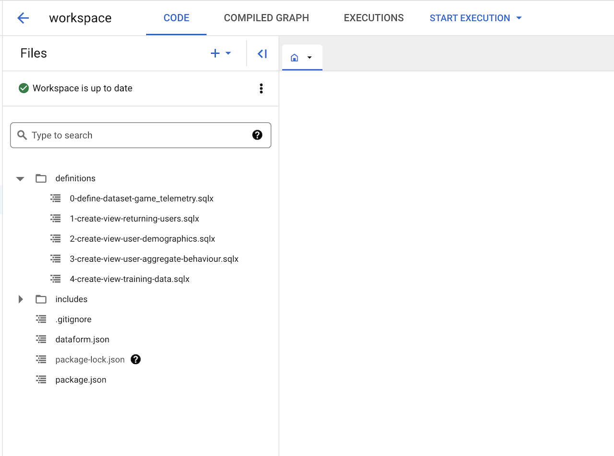

# MLOps for for Games

This project provides an end-to-end data framework to support the personalization of live game enviroments using Google Cloud products and open source gaming solutions. The platform may be used in it's entirety, or as components. 

The architecture is designed to highlight the data and machine learning operations, and how these can be designed in a highly automated, event-based way. There are two use cases: 
*   Predicting player Churn: This is a batch prediciton use case and involves data preperation and a scheduled ML model training, available to the game clients to regularly check a user's churn likelyhood
*   Predicting player's propensity to spend: This is an online/live prediction style use case and involves hosting a regression model for predicting player spend inside a Tensorflow serving container, alongside the gaming services in the GKe cluster to minimize latency.


Projects and products utilised include:

*   A custom [Go](https://go.dev/) API service.
*   [Terraform](https://www.terraform.io/), for infrastructure as code.
*   [Cloud Build](https://cloud.google.com/build) for Continuous Integration and Deployment.
*   [GKE Autopilot](https://cloud.google.com/kubernetes-engine/docs/concepts/autopilot-overview) for hosting the backend microservices.
*   Globally distributed [GKE](https://cloud.google.com/kubernetes-engine) Autopilot for hosting and scaling game servers and ML serving containers.
*   [Dataflow](https://cloud.google.com/dataflow) for running a data streaming pipeline.
*   [BigQuery ML](https://cloud.google.com/bigquery/docs/bqml-introduction) for building Machine Learning models in Bigquery with SQL.
*   [AutoML](https://cloud.google.com/vertex-ai/docs/beginner/beginners-guide) for no-code, highly automated Machine Learning training.
*   [Vertex AI](https://cloud.google.com/vertex-ai) for training, deploying, and hosting machine learning models and creating MLOps pipelines.

<br>

A high level architecture is show here, with more detailed use-case specigic diagrams for the MLOps architectures to be shown later:

<br>


<br>

# Project Structure 

| Folder                      | Description |
|-----------------------------|-------------|
| [Infra](./infra) | This contains all Terraform to build out the Infrastructure and MLOps |
| [Services](./services) | Custom services that get containerised and deployed across the architecture |
| [K8s](./k8s) | Kubernetes resource manifests to deploy and customise the deployed services |
| [ML Training/Player Churn](./ml_traiing/player_churn) | Resources required for the Player Churn use case|
| [Ml Training/Predict Spend](./ml_training/predict_spend) | Resources required for the Predict Spend use case|

<br>

# Setting up the Platform 

### Pre-requisites

The Unified Data Framework assumes assumes default VPC settings and firewall rules. In the case that that those are not in place, you can view the following commands below to configure the starting point.

VPC:

```
gcloud compute networks create default \
    --subnet-mode=auto \
    --bgp-routing-mode=regional \
    --mtu=1460
```

Firewall rules:

```
gcloud compute firewall-rules create default-allow-internal \
  --network default \
  --allow tcp:0-65535,udp:0-65535,icmp \
  --source-ranges 10.128.0.0/9

gcloud compute firewall-rules create default-allow-ssh \
  --network default \
  --allow tcp:22 \
  --source-ranges 0.0.0.0/0

gcloud compute firewall-rules create default-allow-icmp \
  --network default \
  --allow icmp \
  --source-ranges 0.0.0.0/0
```

### Provision Cloud Infrastructure via Terraform

0. [OPTIONAL] If you are running this in a restricted Google Cloud environment, you may need to reduce the restrictions on certain Organisation Policies before deployment. If you are authorised to do so, you can run this .sh file to configure Org Policies appropriately:
```
. org-policy-setup.sh
```

1. Follow the intructions for [mirroring a GitHub repository](https://cloud.google.com/source-repositories/docs/mirroring-a-github-repository) to create a Cloud Source Repos mirrored repo in your Project.

2. Save the name of your Cloud Source Repos repo and your GCP Region to the setup file:
```
cp "setup.example.sh" "setup.sh"

export GCP_PROJECT_ID=<CHANGE ME>
export GCP_REGION=<CHANGE ME> #We have tested for us-central1, but you may want to try with another region
export CLOUD_SOURCE_REPO_NAME=<CHANGE ME>

# For Windows machines:
# sed -i "s/YOUR_GCP_REGION/$GCP_REGION/g" "setup.sh"
# sed -i "s/YOUR_PROJECT_ID/$GCP_PROJECT_ID/g" "setup.sh"
# sed -i "s/YOUR_CLOUD_SOURCE_REPO_NAME/$CLOUD_SOURCE_REPO_NAME/g" "setup.sh"

# For non-Windows machines:
sed -i.bak "s/YOUR_PROJECT_ID/$GCP_PROJECT_ID/g" "setup.sh"
sed -i.bak "s/YOUR_GCP_REGION/$GCP_REGION/g" "setup.sh"
sed -i.bak "s/YOUR_CLOUD_SOURCE_REPO_NAME/$CLOUD_SOURCE_REPO_NAME/g" "setup.sh"
rm "setup.sh.bak"
```

3. run the setup file
```
. setup.sh
```

You will now have a Terraform Apply job running in Cloud Build. Check Cloud Build to monitor its status. 
Once the Terraform rolls out successfully, you can continue to the MLOps setup.

Once Terraform has successfully rolled out, there will be a number of Cloud Build Triggers created that should each be run to build the required Docker Images used across the architecture.

4. Build and deploy the streaming-beam Dataflow service

This Image is built from the source code in /services/dataflow.
This pipeline will pull event messages published onto a PubSub Topic (default topic name is game_telemetry_streaming_topic), then run some transformation steps and write the events to the BigQuery table (default table is: unified_data.game_telemetry)
The Cloud Build Trigger that was created by Terraform in the previous step will build the Image for your events streaming pipeline that will run on Dataflow.

- Run the Cloud Build job for the streaming-beam service via its Cloud Build Trigger:
```
gcloud builds triggers run streaming-beam --region=$GCP_REGION --project=$GCP_PROJECT_ID --branch=main
```

Check the status of the build, and wait until all it has completed before moving on to the next step.

5. Build and deploy the event-ingest service

The Event Ingest service will be deployed to GKE and is responsible for receiving and routing all game telemetry data from Game clients through to the MLOps pipeline.
The Event Ingest service is also resposible for sending spend prediction requests to the spend ml serving image and returning prediction results back to the game clients.
The Event Ingest service is also resposible for sending churn lookup requests to the churn lookup service and returning user churn results back to the game clients.

- Run the Cloud Build job for the event-ingest service via its Cloud Build Trigger that was created by Terraform in the previous step:
```
gcloud builds triggers run event-ingest --region=$GCP_REGION --project=$GCP_PROJECT_ID --branch=main
```

6. Test the event-ingest endpoint

Get the Pod name of event ingest service running on GKE:
```
gcloud container clusters get-credentials game-platform-services --region $GCP_REGION --project $GCP_PROJECT_ID
```
```
export EVENT_INGEST_POD_NAME=$(kubectl get pod -l app=event-ingest -n game-event-ns -o jsonpath="{.items[0].metadata.name}")
```

Set up port forwarding:
```
kubectl port-forward $EVENT_INGEST_POD_NAME -n game-event-ns 7777:7777
```

In a new terminal window, send test data to the endpoint:

```
python3 services/event_ingest/send_tcp_traffic.py --host 127.0.0.1 --runtime_seconds 1 --port 7777
```

This will send a single event to the event ingest servince, which should then be sent on to PubSub > Dataflow and written into the BigQuery table `unified_data.game_telemetry`.

<br>

# Using the platform

### Use Case 1: Predict player spend propensity

In this use case, we predict a player's liklehood to spend in-game currency and the value they are likely to spend. The target for this is the `spend_virtual_currency_value` column in the `unified_data.game_telemetry` data. We use Vertex AI Pipelines to create an MLOps pipeline that creates and exports the model we need. AutoML is used to train the model, but orchestrated through Vertex AI Pipelines.

The VertexAI Pipeline does the following:
*  Creates a View called `spend` that contains the relevant labels and targets for training
*  Creates a Vertex AI Dataset from this View
*  Creates an AutoML Tabular training job, targeting the `spend_virtual_currency_value`
*  Deploys this model to a Vertex AI Endpoint
*  Exports this model to GCS so it can be containerised and deployed to GKE

<br>


<br>

Once the pipeline completes, a Cloud Build job is run that builds a Docker image from the exported model artifacts in GCS, then deploys the image as a container into the cluster, allowing for serving of the spend model and low-latency between the event-ingest service and the model.

1. Triggering the pipeline manually

Most prerequisites have been deployed and configured for this use case through the Terraform applied previously.

What remains is to build and deploy a custom Cloud Run service that sits between the Vertex AI Pipeline and the Cloud Build job to containerise the model. This Cloud Build servics is essentially a filter, and allows us to only trigger the Cloud Build job when the `saved_model.pb` file is updated. Otherwise, Cloud Build would be triggered for every update of any Object in the `gs://<PROJECT_ID>-mlops-spend` bucket.

- Build and Deploy the Cloud Run trigger service:
```
gcloud builds triggers run ml-training-spend-cloudrun-build-serving-image	--region=$GCP_REGION --project=$GCP_PROJECT_ID --branch=main
```
Now the pipeline can be ran, and the outputted model files will automatically be built into a serving image and deployed to GKE.

The pipeline configuration file has been deployed to GCS at the location `gs://<PROJECT_ID>-mlops-spend/spend_pipeline.yaml` and can be seen in the source code at [infra/tf/modules/machine-learning-operations/resources/spend_pipeline.yaml](infra/tf/modules/machine-learning-operations/resources/spend_pipeline.yaml). The Vertex AI pipeline can be run manually with the [pipeline.py](ml_training/predict_spend/pipeline.py) file. There is also an interactive notebook [pipeline.ipynb](ml_training/predict_spend/pipeline.ipynb) containing the same code, which could be uploaded as a Vertex AI Workbench to similuate a Data Scientist's developer environment.

- Run the pipeline:
```
cd ml_training/predict_spend
```
```
python3 -m venv venv
```
```
source venv/bin/activate
```
```
pip3 install -r requirements.txt
```
```
python3 pipeline.py --project_id=$GCP_PROJECT_ID --location=$GCP_REGION
```

This will create a new pipeline config file at `ml_training/predict_spend/spend_pipeline.yaml` , upload and overwrite the existing pipeline config file in GCS, and run the Vertex AI pipeline in your Project.

Feel free to make changes to the pipeline via the [pipeline.py](ml_training/predict_spend/pipeline.py) file. Terraform has been configured so it will not subsequently overwrite the spend_pipeline.py file if it does get overwritten manually via the [pipeline.py](ml_training/predict_spend/pipeline.py) file.

The pipeline will take some time (1+ hours) to complete when it is first ran. It is set to cache outputs, so subsequent runs of the pipeline may be faster. 

Once it does complete, the Cloud Build job will start to build and deploy the model as a model serving container. You can follow the statuses of the pipeline and the Cloud Build job through the console or with gcloud commands, and eventually you should see a new Deployment in the GKE cluster that has status Ready:
```
gcloud container clusters get-credentials game-platform-services --region $GCP_REGION --project $GCP_PROJECT_ID
```
```
kubectl describe deployment ml-serving-spend -n game-event-ns
```

2. Test the ml-serving-spend endpoint directly

You can check that the service is functioning correctly by directly sending a prediction request to it.

Get the Pod name of ml-serving-spend service running on GKE:
```
export ML_SERVING_SPEND_POD_NAME=$(kubectl get pod -l app=ml-serving-spend -n game-event-ns -o jsonpath="{.items[0].metadata.name}")
```

Set up port forwarding:
```
kubectl port-forward $ML_SERVING_SPEND_POD_NAME -n game-event-ns 8080:8080
```

In a new terminal window, send test data to the endpoint through port forwarding (this will send dummy data through to the prediction endpoint in order to get a prediction/score).
```
curl -d '{
  "instances": [
    {
      "event_name":"spend_virtual_currency",
      "event_date": "2023-12-08",
      "event_timestamp": "4",
      "event_previous_timestamp": "513655555555555",
      "event_bundle_sequence_id": "555",
      "event_server_timestamp_offset": "578636",
      "user_pseudo_id": "D50D60807F5347EB64EF0CD5A3D4C4CD",
      "user_first_touch_timestamp": "1512367843288363",
      "operating_system": "ANDROID",
      "language": "en-us",
      "country": "United States"
    }
  ]
}' -X POST http:/localhost:8080/predict
```

3. Test the ml-serving-spend service via the event_ingest service

The test script. [services/event_ingest/send_tcp_traffic.py](services/event_ingest/send_tcp_traffic.py) accepts a parameter to enable a spend prediction for the sent data. By adding `--ml_flag=spend` as a runtime argument, the key/value pair 'ml':'spend' will be added to the input data, and if this is present, the event_ingest service will also send a prediction to the ML serving model for the spend prediction. The results from the prediction request will be returned in the output from the [services/event_ingest/send_tcp_traffic.py](services/event_ingest/send_tcp_traffic.py) script

Get the Pod name of event ingest service running on GKE:
```
export EVENT_INGEST_POD_NAME=$(kubectl get pod -l app=event-ingest -n game-event-ns -o jsonpath="{.items[0].metadata.name}")
```

Set up port forwarding:
```
kubectl port-forward $EVENT_INGEST_POD_NAME -n game-event-ns 7777:7777
```

In a new terminal window, send test data to the endpoint with the --ml_flag=spend parameter:

```
python3 services/event_ingest/send_tcp_traffic.py --host 127.0.0.1 --runtime_seconds 1 --port 7777 --ml_flag spend
```

Feel free to edit the input payload in the [services/event_ingest/send_tcp_traffic.py](services/event_ingest/send_tcp_traffic.py) script and see how it effects the prediction.


4. Triggering the pipeline automatically through increased game telemetry load:

The Vertex AI Pipeline is configured to be automatically triggered in the event of increased numbers of Write requests are sent from Dataflow to BigQuery. There are a number of components involved in this:
*   A Cloud Monitoring Alert Policy that is configured to fire an alert when the Write threshold into BigQuery exceeds a threshold (default is 1000 requests delta in 15 mins) 
*   A Cloud Monitoring Notification Channel to send a message to a PubSub Topic when the alert is fired
*   A PubSub Push subscription to push an HTTP message to a Cloud Run endpoint
*   A Cloud Run service invoked by the PubSub topic above, which triggers the Vertex AI Pipeline via a REST API call.

<br>


<br>

Most of this this is already setup through the Terraform applied previously. As before, what remains is to deploy the custom Cloud Run triggering service used to create the Pipeline Job in the event of the BigQuery update alert being fired.

```
gcloud builds triggers run ml-training-spend-cloudrun-run-pipeline --region=$GCP_REGION --project=$GCP_PROJECT_ID --branch=main
```

We are now ready to trigger the end-to-end MlOps pipeline by increasing the traffic load from game clients that is sent through to the event ingest service and on to BigQuery.

To increase the load into BigQuery enough to trigger the pipeline, we can edit and deploy the [tcp-load Deployment](k8s/templates/tcp-load.example.yaml). The default is 10 replicas which will each sent a stream of messages for 3 minutes. This will be enough to triger the Monitoring Alert and run the pipeline:
```
envsubst < "k8s/templates/tcp-load.example.yaml" > "k8s/tcp-load.yaml"
```
```
gcloud container clusters get-credentials game-platform-services --region $GCP_REGION --project $GCP_PROJECT_ID
```
```
kubectl apply -f k8s/tcp-load.yaml
```

- Observe the event_ingest service autoscaling in response to the increasing numner of messages. Review and edit the Kubernetes Horizontal Pod Autoscaler manifest to optimise this scaling behaviour
- Also observe if/how the Dataflow job autoscales in response to the load change
- Observe the Alert Policy in place for BigQuery Write requests, and watch as the request rate goes above the alerting threshold
- Observe a new training job in Vertex AI being created due to the Alert
- Observe a new build of the spend model serving image in response to the update to the model files in GCS.

<br>


### Use Case 2: Predict player churn

In this step, you'll prepare the raw ingested game telemetry data ready for training a user churn prediction model. This will follow the example given in this [blog post](https://cloud.google.com/blog/topics/developers-practitioners/churn-prediction-game-developers-using-google-analytics-4-ga4-and-bigquery-ml) and its linked [python notebook](https://github.com/GoogleCloudPlatform/analytics-componentized-patterns/blob/master/gaming/propensity-model/bqml/bqml_ga4_gaming_propensity_to_churn.ipynb) and we suggest you familiarise yourself with this example before continuing.

The source data from the blog has already been copied into your Project via the Terraform rollout. By default this will be a dataset and table in your Project, with dataset ID `unified_data` and table name `game_telemetry`.

For your convenience, the SQL queries from the blog have been placed into four files in this repository, found in the [ml_training/player_churn/bigquery_saved_queries/](ml_training/player_churn/bigquery_saved_queries/) directory. We suggest you save the contents of each of these files as four seperate [Saved Queries](https://cloud.google.com/bigquery/docs/work-with-saved-queries), then uncomment and run each query in turn as you proceed with the steps below.

Once the churn prediction models are created, we will run a batch prediction against the model and provide the results of the prediction to a churn-lookup service which will be deployed to GKE and called by the event-ingest service to get low latency notifications on the likelihood of a user churning.

<br>


<br>

1. Perform the data preperation steps via BigQuery

- Run the queries in [prep-data.sql.txt](ml_training/player_churn/bigquery_saved_queries/prep-data.sql.txt). Once you have done this, you should have performed a number of data preperation steps as explained in the [blog post](https://cloud.google.com/blog/topics/developers-practitioners/churn-prediction-game-developers-using-google-analytics-4-ga4-and-bigquery-ml), and should have a View called 'churn_training_data' which is your prepped training data ready to train the churn models with.

2. Perform the model training steps with BigQueryML

- Run the queries found in [train-models.sql.txt](ml_training/player_churn/bigquery_saved_queries/train-models.sql.txt)

Once you have done this, You should then have three seperate ML models (logistic regression, XGBoost and a Deep Neural Network) that you have trained through [BigQueryML](https://cloud.google.com/bigquery/docs/bqml-introduction) that are available to you on the BigQuery Explorer UI. 

3. Evaluate these models and execute predictions using them.

- Run the evaluation queries found in [evaluate.sql.txt](ml_training/player_churn/bigquery_saved_queries/evaluate.sql.txt) and follow the details and explanations about these evaluations in the [blog post](https://cloud.google.com/blog/topics/developers-practitioners/churn-prediction-game-developers-using-google-analytics-4-ga4-and-bigquery-ml). 

Once you have done this, you would have analysed each of the models to understand their characteristics and performance.

4. Run and export predictions using the models

- Run the queries in [predict.sql.txt](ml_training/player_churn/bigquery_saved_queries/predict.sql.txt) using your chosen Model. The default is the XGBoost model. 

Once you have done this, you would have created batch prediction results from the models that give the probabiliy of each user churning. The final query will export the results to a GCS file, so the results can be used as a lookup by the event-ingest service and provide low latency notifications to game clients if a user has a high likelyhood of churning. 

5. Deploy the churn-lookup service to provide low-latency churn lookups for the event-ingest service

As part of the Terraform rollout in step 1, the following has already been created:
*   A Cloud Storage PubSub notification that sends a PubSub message to topic `churn-model-artifacts-update-notifications` whenever the batch prediction export .csv from step 4 is updated
*   A Cloud Build Trigger to schedules the build of the 'churn-lookup' service, triggered by a PubSub message published to the `churn-model-artifacts-update-notifications` topic.

This means you should already have this service deployed. Check on its status:
```
gcloud container clusters get-credentials game-platform-services --region $GCP_REGION --project $GCP_PROJECT_ID
```
```
kubectl describe deployment churn-lookup -n game-event-ns
```

The service's source code be seen at [services/churn_lookup/](services/churn_lookup/main.go). You can see that on startup, the service will download the exported predictions from GCS and hold in memory. It then creates an API server listening on /user, expecting a request payload containing a `pseudo_user_id`, and will return the prediction results for that `pseudo_user_id`.

6. Test the churn-lookup endpoint directly

You can check that the service is functioning correctly by directly sending a lookup request to it.

Get the Pod name of churn-lookup service running on GKE:
```
export CHURN_LOOKUP_POD_NAME=$(kubectl get pod -l app=churn-lookup -n game-event-ns -o jsonpath="{.items[0].metadata.name}")
```

Set up port forwarding:
```
kubectl port-forward $CHURN_LOOKUP_POD_NAME -n game-event-ns 8080:8080
```

In a new terminal window, send test data to the endpoint through port forwarding (this will send dummy data through to the prediction endpoint in order to get a prediction/score).
```
curl -X POST -H 'Content-Type: application/json' -d '{ "user_pseudo_id": "0E7609CA977178EC4C6F0191922FC45A" }' http://localhost:8080/user
```

7. Test the churn-lookup service via the event_ingest service

The test script. [services/event_ingest/send_tcp_traffic.py](services/event_ingest/send_tcp_traffic.py) accepts a parameter to enable a spend prediction for the sent data. By adding `--ml_flag=churn` as a runtime argument, the key/value pair 'ml':'churn' will be added to the input data, and if this is present, the event_ingest service will also send a churn lookup request to the churn-lookup service. The results from lookup request will be returned in the output from the [services/event_ingest/send_tcp_traffic.py](services/event_ingest/send_tcp_traffic.py) script

Get the Pod name of event ingest service running on GKE:
```
export EVENT_INGEST_POD_NAME=$(kubectl get pod -l app=event-ingest -n game-event-ns -o jsonpath="{.items[0].metadata.name}")
```

Set up port forwarding:
```
kubectl port-forward $EVENT_INGEST_POD_NAME -n game-event-ns 7777:7777
```

In a new terminal window, send test data to the endpoint with the --ml_flag=spend parameter:

```
python3 services/event_ingest/send_tcp_traffic.py --host 127.0.0.1 --runtime_seconds 1 --port 7777 --ml_flag churn
```

Feel free to edit the input payload in the [services/event_ingest/send_tcp_traffic.py](services/event_ingest/send_tcp_traffic.py) script and see how it effects the prediction.

8. Use Dataform to configure the MLOps churn pipeline stages

Optionally, we could setup a MLOps pipeline to automate all the stages of the MLOps workflow for the churn use case: prep > training > prediction > export.

One way to do this would be [Dataform](https://cloud.google.com/dataform?hl=en), a managed service from Google Cloud providing serverless orchestration for data pipelines.

This way, we can create:
*  A Dataform git-based source code repository for version control on SQL commands
*  Sequential execution of SQL commands, with parameterisation, variable assignment and input/output control
*  A cron-based release schedule to run the MLOps workflow at regular intervals.

As well as run on a schedule, we can also run immediately via an API call, as so as before we can setup a triggering flow based on the arrival of new data into BigQuery:
BigQuery > Cloud Monitoring Alert > PubSub notification topic > Cloud Run service invocation > Cloud Run schedules a workflow execution via the Dataform API.

This end-to-end MLOps pipeline is shown in the diagram below:

<br>


<br>

Most of these components are already in place from the Terraform rollout:
*  Cloud Monitoring Alert
*  PubSub notification topic
*  Placeholder Cloud Run service
*  Dataform repository
*  Dataform workflow and release configurations

All that remains is to:
*  build and deploy the triggering image into the Cloud Run placeholder service
*  Create a Dataform Workspace and add the Dataform definition files into it

Create the Cloud Run service by running its Cloud Build trigger:

```
gcloud builds triggers run ml-training-churn-cloudrun-run-dataform --region=$GCP_REGION --project=$GCP_PROJECT_ID --branch=main
```

Add the Dataform definition files to Dataform:

The files you need can be found at [ml_training/player_churn/dataform/](./ml_training/player_churn/dataform/). Create a [Dataform workspace](https://cloud.google.com/dataform/docs/create-workspace) and either follow the instructions to [connect to a third-party repository](https://cloud.google.com/dataform/docs/connect-repository) or manually upload the files into your workspace. You should end up with a workspace that looks like this:



Workflow and release configurations are already in place to run this series of SQL statements at a regular interval (default is every 24hrs). 

9. Triggering the pipeline automatically through increased game telemetry load:

The churn use case is now setup for a full end-to-end automatic triggering in the event of increased numbers of Write requests are sent from Dataflow to BigQuery. There are a number of components involved in this:
*   A Cloud Monitoring Alert Policy that is configured to fire an alert when the Write threshold into BigQuery exceeds a threshold (default is 1000 requests delta in 15 mins) 
*   A Cloud Monitoring Notification Channel to send a message to a PubSub Topic when the alert is fired
*   A PubSub Push subscription to push an HTTP message to a Cloud Run endpoint
*   A Cloud Run service invoked by the PubSub topic above, which triggers the Dataform release execution.

To increase the load into BigQuery enough to trigger the pipeline, we can edit and deploy the [tcp-load Deployment](k8s/templates/tcp-load.example.yaml). The default is 15 replicas which will each sent a stream of messages for 3 minutes. This will be enough to triger the Monitoring Alert and run the pipeline:
```
envsubst < "k8s/templates/tcp-load.example.yaml" > "k8s/tcp-load.yaml"
```
```
gcloud container clusters get-credentials game-platform-services --region $GCP_REGION --project $GCP_PROJECT_ID
```
```
kubectl apply -f k8s/tcp-load.yaml
```

- Observe the event_ingest service autoscaling in response to the increasing numner of messages. Review and edit the Kubernetes Horizontal Pod Autoscaler manifest to optimise this scaling behaviour
- Also observe if/how the Dataflow job autoscales in response to the load change
- Observe the Alert Policy in place for BigQuery Write requests, and watch as the request rate goes above the alerting threshold
- Observe a new Dataform release execution created due to the Alert
- Observe a new batch prediction export object uploaded to GCS at location `gs://<YOUR-PROJECT-ID>-mlops-churn/churn-batch-predictions/*.csv`
- Observe the update to the batch prediction files triggering a rebuild of the churn-lookup service.